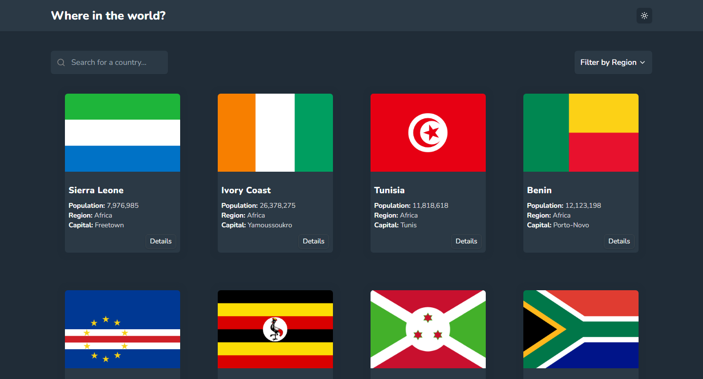
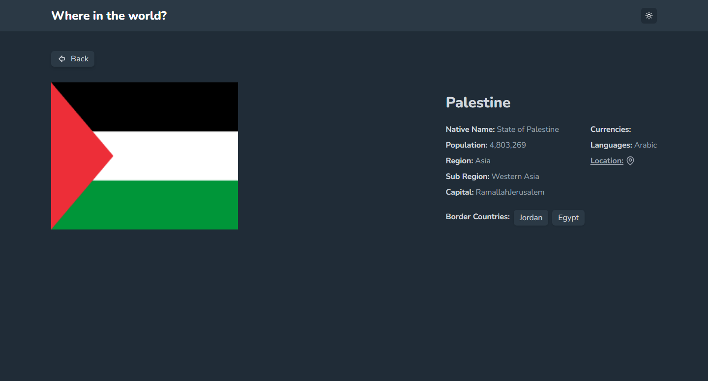

# React Country App

**Description:**
A comprehensive React application showcasing world countries with interactive features and stunning visuals. Built with TypeScript for type safety, Tailwind CSS for rapid UI development, and Framer Motion for dynamic animations.

**Screenshots:**

**Features:**

- See all countries from the API on the homepage.
- Search for countries by name, and filter by region.
- Detailed country information including flags, population, languages, etc...
- Stunning animations and transitions powered by Framer Motion.
- Toggle the color scheme between light and dark mode.
- Click through to the border countries on the detail page.

**Technologies:**

- [React](https://react.dev/)
- [Typescript](https://www.typescriptlang.org/)
- [Tailwind CSS](https://tailwindcss.com/) - A Utility-First CSS Framework.
- [Framer Motion](https://www.framer.com/motion/) - A Powerful Animation Library for React.

**Links:**

- Solution URL: [Add solution URL here](https://your-solution-url.com)
- Live Site URL: [https://rest-countries-api-app2.netlify.app/](https://rest-countries-api-app2.netlify.app/)

**Author:**

- Frontend Mentor: [Mahmoud ELagamy](https://www.frontendmentor.io/profile/Mahmoud-ElAgamy)
